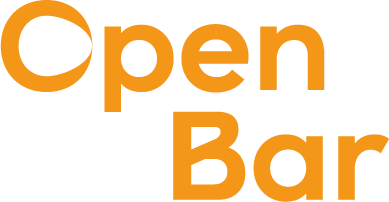
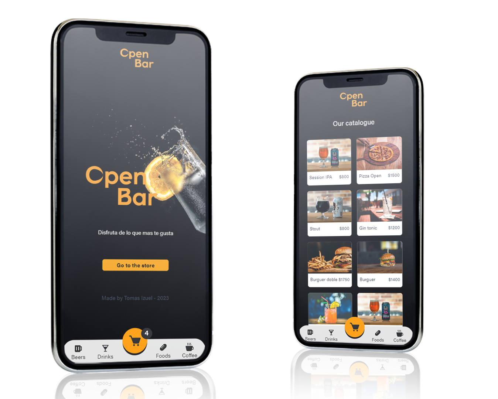

### What is OpenBar?

Open Bar is the app designed specifically for bars to sell their products more efficiently! With Open Bar, bar owners can easily manage their inventory and track their sales in real-time. Our user-friendly interface allows bar owners to quickly add and update their menu items, view their profits, and process orders all in one place.

### Deploy

[Enjoy OpenBar](https://link-url-here.org)

### Dependencies:

- Firebase | 9.17.1 | Used to persist the products of the bar
- React | 18.2.0 | App built in React
- Vite | 4.0.0 | Deploy with react and vite
- React-dom | 18.2.0 | OpenBar is for the moment a web app. React dom provides the methods necessary to create web applications
- React-router-dom | 18.2.0 | Used to manage the routes of the application
- SweetAlert2 | 11.7.1 | Used send push notifications after buy or order products
- Tailwind | 3.2.4 | Used for the styles of the app
- Autoprefixer | 10.4.13 | Complement to taildwind
- Postcss | 8.4.20 | Complement to taildwind

## Important!

For the moment, openBar is only builded to mobile devices. It's extremely recomended to not use in other devices

### Desk codes:

- awf2123

#### [Tomas Izuel](https://github.com/Tomas-Izuel) - 2023 - [CoderHouse](https://www.coderhouse.com/)
